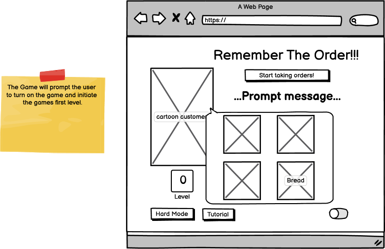
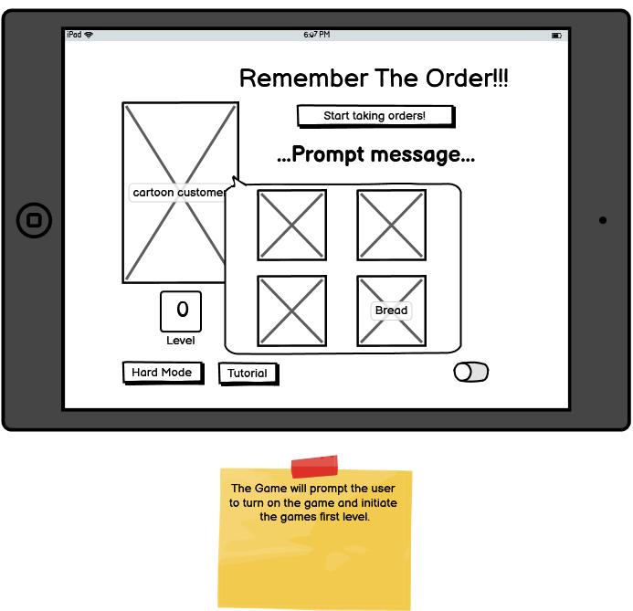
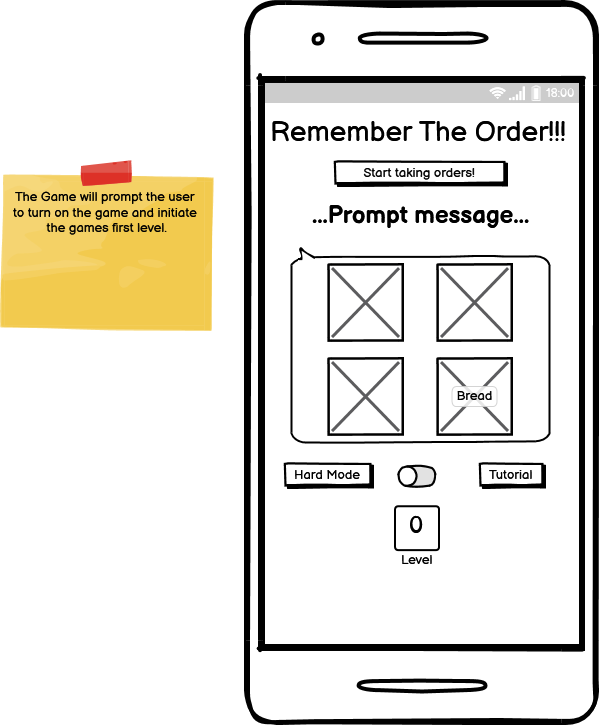
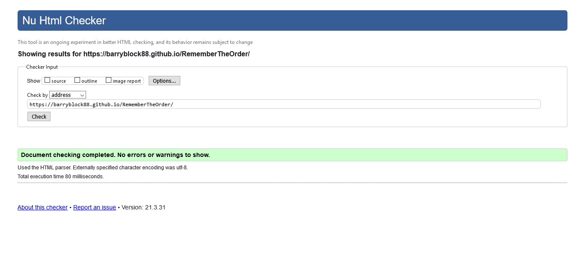
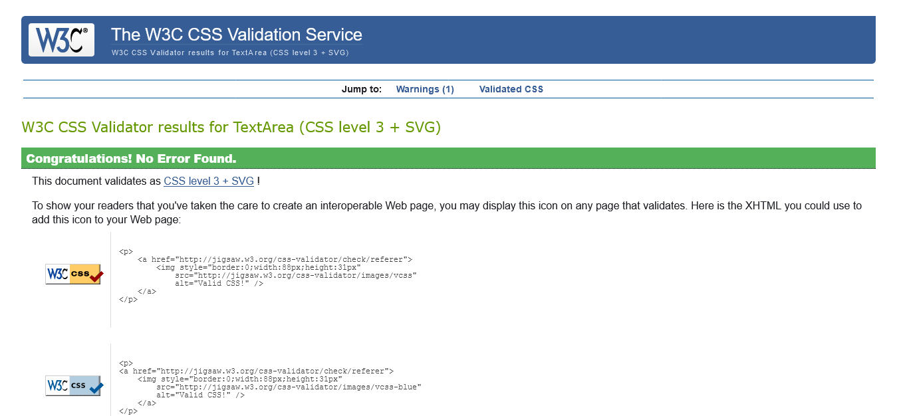
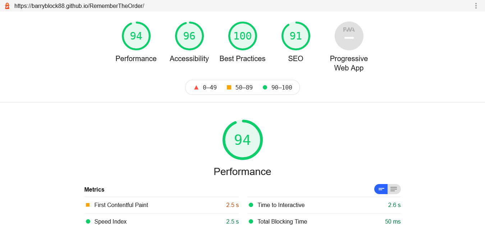
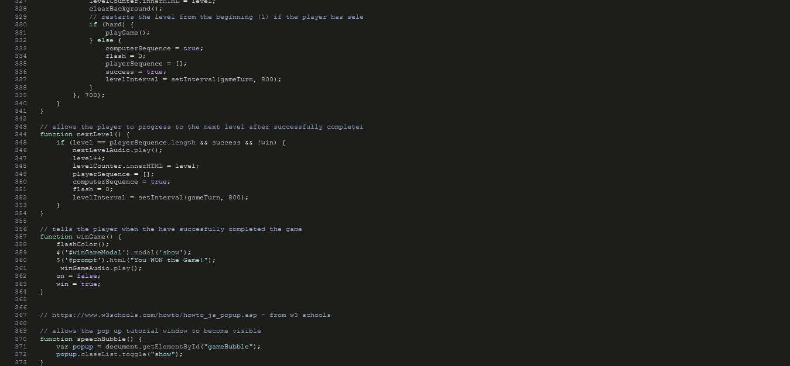

# Milestone_Project_Two_
### Developer/Author - Barry Cullen
 

## Table of Contents -
- [Project Outline:](#project-outline-)
  * [Remember The Order! - A bakery themed memory game](#remember-the-order----a-bakery-themed-memory-game)
  * [*UX*](#-ux-)
      - [Who is the target audience of this site?](#who-is-the-target-audience-of-this-site-)
    + [User Stories](#user-stories)
      - [Links to wireframes](#links-to-wireframes)
      - [Mobile](#mobile)
      - [Desktop](#desktop)
    + [Colour design](#colour-design)
      - [Colour palette :](#colour-palette--)
    + [Typography](#typography)
  * [*Features*](#-features-)
    + [Current Features](#current-features)
    + [Additional features to add](#additional-features-to-add)
    + [Technologies Used](#technologies-used)
      - [Languages Used](#languages-used)
    + [Frameworks, Libraries & Programs](#frameworks--libraries---programs)
- [*Testing*](#-testing-)
    + [***Code validation***](#---code-validation---)
      - [W3C Markup Validator -](#w3c-markup-validator--)
      - [W3C CSS Validator -](#w3c-css-validator--)
      - [Lighthouse report -](#lighthouse-report--)
    + [User Story testing](#user-story-testing)
    + [Manual Testing](#manual-testing)
  * [Responsiveness Testing](#responsiveness-testing)
      - [Responsiveness](#responsiveness) 
      - [Phones -](#phones--)
      - [Tablets -](#tablets--)
      - [Laptops -](#laptops--)
  * [*Browser Testing*](#-browser-testing-)
      - [Issues Found -](#issues-found--)
      - [Bugs -](#bugs--)
  * [*Deployment*](#-deployment-)
    + [Hosting on GitHub Pages](#hosting-on-github-pages)
- [*Credits*](#-credits-)
    + [Content](#content)
    + [Code Snippet Credits](#code-snippet-credits)
    + [Media](#media)
    + [Acknowledgements](#acknowledgements)
        * [Websites/Online services used for the project:](#websites-online-services-used-for-the-project-)
  * [Received inspiration for this project from:](#received-inspiration-for-this-project-from-)
      - [Websites, such as  -](#websites--such-as---)
      - [Tutorial -](#tutorial--)
  * [*Advice and support*](#-advice-and-support-)

## This project (Milestone Two) was completed as part of Code Institute's Full Stack Web Development course in 2020/21-
## Project Requirements:
-To create a Dynamic Front End Project, Write custom JavaScript, HTML and CSS code to create a front-end web application consisting of one or more HTML pages with significant interactive functionality. 

# Project Outline:

## Remember The Order! - A bakery themed memory game 

Remember The Order! is a humorous bakery themed memory game in the same vein as the classic Simon Says game of the 70s and 80s.
Which involves the computer making any number of random combinations of four game tiles which the player then has to follow in order to progress to the next level, with each level becoming increasingly more difficult as the number of combinations increases.

The Game begins as a simple presentztion clearly showing all elements and buttons, there is then a clear instruction for the palyer/user to turn on the game to begin.
The site will use a simple warm pleasant colour palatte, with other elements such as the Buttons and the heading in a contrasting but complemetary colour.

There are 8 elements visible to the player as they play the game
1. Game Title/heading that contains the name of this game.
2. The start taking orders Button which will allow the user to initate the game itself.
3. The prompter area with which information on game play as well as the initial begin game prompt will be located.
4. The four game button tiles, each one with an image of a bakery item which is the theme of the game. These will act as the main interface for player/user game play as they will be highlighted by the computer and will need to be replicaed by the player/user.
5. The 'NORMAL' button is a simplifed difficulty setting with allows the player/user to either select normal or hard mode.
6. The 'TUTORIAL' button when clicked on will show popup with a detailed text breakdown of how to play the game.
7. The level counter will allow the player/user to keep take of the level they are on.
8. The 'ON/OFF' button allows the user to reset the game and as a simple opening action to trigger game play.

## *UX*
#### Who is the target audience of this site?

“As a [persona], I [want to], [so that].” 
### User Stories

As a  player/user of this app, I want everything visible imeduiatly and easy to use.

As a player/user of this app, I want there to be enough time for audio and aniamtion to engae with ether me.
As a player/user of this app, I want the game to be easy initally but to become gradually more challenging and I want the option to make it more difficult.
As a  player/user of this app, I want the game to have a visually appealing theme, be simple, engaging and humourous.
As a player/user of this app, I want the game to initeate the directions for game play. 
As a  player/user of this app, I want to know when I've clicked on a button by having a responding audio or visual cue or both.
As a player/user of this app, I want to be able to play this on my phone or laptop.
##Design process

### Links to wireframes

#### Desktop 

- [Desktop2](assets/wireframes/DesktopWireframe2.png)
- [Desktop3](assets/wireframes/DesktopWireframe3.png)
- [Tutorial](assets/wireframes/TutorialPopupWireframe.png)

#### Tablet

- [Tablet2](assets/wireframes/TabletWireframe2.png)
- [Tablet3](assets/wireframes/TabletWireframe3.png)

#### Mobile

- [Mobile2](assets/wireframes/MobileWireframe2.png)
- [Mobile3](assets/wireframes/MobileWireframe3.png)

### Colour design
For the colour palette, from here (https://coolors.co/fffcf2-ccc5b9-403d39-252422-eb5e28I) chose four colours to give it depth using the most vibrant as the background color, so as to  that will provoke a warm response from the player, like that of fresh baking.
The other colours grays and cream colurs where used to create a clear contrast in the buttons and with prompt messages to help readability and engagment. 

#### Colour palette :

- #EB5E28 as the primary background colour to provide a warm colour and a nice contrast to help readability.
- #252422 as a darker gray to help clearly show for the other buttons in the game against the warm background, the majority of the text and the main game title.
- #403D39 for  as a ligher gray to clearly show when start taking orders button is hoovered.
- #CCC5B9 for border color of the game button tiles when error or when the tiles are flashed.
- FFFCF2 ist the colour used sparingly in the project for contrast in hoovered over button text to improve readability.

### Typography

 The font were imported from Google Fonts.
https://fonts.googleapis.com/css2?family=VT323&display=swap
I used this font as it resembles the bitmap fonts used in older games,
as i wanted to give the game a retro feel.

###Audio
I created my own humourous sound effects for the button, errors, next level and for winning the game.
These sound files were used to give the game its interactive sounds.
Created using the open source software. (https://www.audacityteam.org/) 
###Images
The background image design, button image design, tutorial image and tab icon were all designed by Barry Cullen using the open-source software GIMP. (https://www.gimp.org/fr/) 

## *Features*

### Current Features

1. The game will prompt the player/user instructions via messages that will allow intutive game play.
2. The 'ON/OFF' button activates/deactivates the Game.
3. The 'NORMAL/HARD' button allows the player/user to select a greater in game difficulty.
4. Player/user can activate a popup window of the rules of the game by clicking the 'TUTORIAL' button. 
5. Game button tiles flash and play a sound when selected by the player/user.
6. Game button tiles flash and play a sound when activated as part of the computer sequence.
7. Game button tiles all animate, flash a border and play a sound when error is made or if they win the game
8. The level counter allows the player/user to follow there current level, with each success a sound is played and counter increases by one.
9. Remember The Order! is responsive on various devices including smaller mobile devices.

### Additional features to add
1. Move difficulty setting such as being able to increase the speed.
2. I would like to find a way to stop the computer selecting the same tile twice in a row.
3. I would like to change the system from levels to a score based system with a highscore element.
4. I would like to add a mute button to the game as potential player/users may not want sound effects.

### Technologies Used
#### Languages Used
      1. HTML5 
2. CSS3
3. Javascript

### Frameworks, Libraries & Programs
    
1. Code Institute Template - (https://github.com/Code-Institute-Org/gitpod-full-template)
2. Bootstrap 4 (https://getbootstrap.com/) was used to assist with the responsiveness and the Website's grid system.
3. Google Fonts (https://fonts.google.com/)were used to import the 'VT323' font into the style.css file which is used on all pages throughout the project. 
4. Font Awesome (https://fontawesome.com/) for the website icons for UX ease of use.
5. JQuery (https://jquery.com/) used along side the vanilla JS elements in script.js for html / style changes and as a DOM selector for some functions.
6. Gitpod (https://gitpod.io/) was used as a code development environment.
7. Git was used for version control by using the Gitpod terminal to commit to Git and Push to GitHub.
8. GitHub (https://github.com/) is used to store all the code for this project after pushing from Gitpod.
9. GIMP (https://www.gimp.org/fr/) was used to edit photos for the Website.
10. Balsamiq (https://balsamiq.com/) was used to create the wireframes during the design process.
11. Table generator(https://www.tablesgenerator.com/markdown_tables) for the table in the README

# *Testing*

### ***Code validation***
In the project, no syntax errors were detected, as validated by -
#### W3C Markup Validator - 

#### W3C CSS Validator -

#### Lighthouse report -
 
#### jshint report -
I used jshint to discover any errors within the script.js file, there are no errors but only some warnings.

### User Story testing

|  			  			Number 		 |  			 User 			Story 		                                                                                                                                                  |  			  			Validation 		                                                                                                                                                   |  			  			Result  			 		 |
|------------|----------------------------------------------------------------------------------------------------------------------------------------------------------------|------------------------------------------------------------------------------------------------------------------------------------------------------------------|--------------|
|  			  			1  			 		    |  			  			As 			a  player/user of this app, I want everything visible imediately 			and easy to navigate. 			 			 		                                                                |  			 Confirmed 			by having all elements nessacary to play the game visble onload 		                                                                                     |  			  			Pass 		     |
|  			  			2  			 		    |  			 As 			a player/user 			of 			this app, I want there to be enough time for audio and aniamtion 			to engage with me. 		                                                     |  			  			The 			javascript has been updated to allow the enough time to have the 			audio play 		                                                                              |  			  			Pass  			 		   |
|  			  			3  			 		    |  			 As 			a player/user 			of 			this app, I want the game to be easy initally but to become 			gradually more challenging and I want the option to make it more 			difficult. 		 |  			 Confirmed 			through the addtional items to remember as each level progresses 		                                                                                    |  			  			Pass  			 		   |
|  			  			4  			 		    |  			  			  			 As 			a  player/user 			of 			this app, I want the 			game 			to have a visually appealing theme, 			be simple, engaging and humourous. 		                                   |  			 Confirmed 			through the use of colours, cartoon images and humourous audio 		                                                                                      |  			  			Pass  			 		   |
|  			  			5  			 		    |  			 As 			a player/user 			of this app, I want the game to initeate the directions for game 			play.  			 		                                                                   |  			 Confirmed 			through the use of regular prompt messages which coax the player 			into action 		                                                                        |  			  			Pass  			 		   |
|  			  			6  			 		    |  			 As 			a  player/user 			of 			this app, I want to know when I've clicked on a button by having a 			responding audio or visual cue or both. 		                             |  			  			Confirmed 			by the player triggered javascript events changing various styles 			on the page and playing sound effects and but the hover elemenst 			in the css file 		 |  			  			Pass  			 		   |
|  			  			7  			 		    |  			  			  			  			As 			a player/user of this app, I want to be able to play this on my 			phone or laptop. 		                                                                    |  			  			Resposiveness 			functionality tested throughly on various phone screens to allow 			for better UX. 		                                                                |  			  			Pass  			 		   |

### Manual Testing

|  				 Test Case 			 |                                                                    				 Description of feature 			                                                                  |  				 Result 			 |
|:------------:|:------------------------------------------------------------------------------------------------------------------------------------------------------------:|:---------:|
|  				 1 			         |  				 When the site loads on a laptop the user should see 				a title, 4 image tiles and 4 buttons 			                                                                  |  				 Pass 			   |
|  				 2 			         |  				 Hovering over 'Start taking orders' button with the 				mouse cursor, the text turns from light shades to darker shades 			                                       |  				 Pass 			   |
|  				 3 			         |  				 Clicking on the 'Start taking orders' button 				changes the prompt message to alert the user to turn on the game 			                                             |  				 Pass 			   |
|  				 4 			         |  				 Clicking on the game button tiles when the game is 				OFF will trigger no affect 			                                                                             |  				 Pass 			   |
|  				 5 			         |  				 Normal/Hard button will always change text color to 				show it is active or not 			                                                                              |  				 Pass 			   |
|  				 6 			         |  				 On/off button will always change text color to show 				it is active or not 			                                                                                   |  				 Pass 			   |
|  				 7 			         |  				 Clicking on the game button tiles when the game is 				ON  will trigger javascript events 			                                                                     |  				 Pass 			   |
|  				 8 			         |  				 Hovering over game tiles changes with the mouse 				cursor the background color and removes it when mouse leaves 			                                              |  				 Pass 			   |
|  				 9 			         |  				 Clicking on the Tutorial button will trigger a pop 				up window 			                                                                                              |  				 Pass 			   |
|  				 10 			        |  				 Clicking on the tutorial pop up window will will 				trigger the window to close 			                                                                              |  				 Pass 			   |
|  				 11 			        |  				 Winning the game triggers a pop up modal 			                                                                                                                  |  				 Pass 			   |
|  				 12 			        |  				 Clicking the ON button changes the prompt message 				to alert the user to begin the game 			                                                                     |  				 Pass 			   |
|  				 13 			        |  				 Clicking the 'Start taking orders' button changes 				the prompt message to alert the user to watch the game button 				tiles closely and the initate their turn. 			 |  				 Pass 			   |
|  				 14 			        |  				 On computer turn the main background colour changes 				and changes back to original style after computer turn is 				complete 			                                    |  				 Pass 			   |
|  				 15 			        |  				 Tutorial popup window is resposive in mobile(small 				and medium size), tablet and laptop 			                                                                    |  				 Pass 			   |
|  				 16 			        |  				 When the site loads on a mobile the user should see 				a title, 4 image tiles and 4 buttons 			                                                                  |  				 Pass 			   |
|  				 17 			        |  				 When the site loads on a tablet the user should see 				a title, 4 image tiles and 4 buttons 			                                                                  |  				 Pass 			   |

## Responsiveness Testing
#### Responsiveness
The Website was viewed on devices in real life such as Desktop, Laptop, Huawei Y6, iPhone 5/6, iPhone 7/8, Samsung A1.
###### Tested using (https://responsivedesignchecker.com)
- [Mobile1](assets/testing/resposiveness/Screenshot_2021-04-02_Responsive_Website_Design_Tester_Mobile1.png) 
- [Mobile2](assets/testing/resposiveness/Screenshot_2021-04-02_Responsive_Website_Design_Tester_Mobile2.png)
- [Mobile3](assets/testing/resposiveness/Screenshot_2021-04-02_Responsive_Website_Design_Tester_Mobile3.png)
- [Tablet](assets/testing/resposiveness/Screenshot_2021-04-02_Responsive_Website_Design_Tester_Mobile1.png)

### *Using inspect elements on firefox i checked responsiveness for the following*
#### Phones -
Galaxy Note 3Android 4.3
Galaxy S5Android 5.0
Galaxy S9/S9+Android 7.0
iPhone 5/SEiOS 10.3.1
iPhone 6/7/8iOS 11
iPhone 6/7/8 PlusiOS 11
iPhone XS MaxiOS 12

#### Tablets -
iPad
iPad Mini
Kindle Fire HDXLinux
#### Laptops -
Laptop Acer Aspire 1

## *Browser Testing*
The Website was tested on Firefox, Google Chrome, Microsoft Edge and Safari browsers. 
#### Issues Found -
- Had difficuly styling the Pop up window for the tutorial with CSS for smaller screens was a challenge, after some intensive research and hours of trial and error, i got the pop up to work among the highest number of screen sizes i could, as there are now both large and small mobile phones and many varitions of screen size.
- Bootstrap with customisation was a bit messy at first so i decided to start again with a much simpler layout for the game as well as removing the score /high score areas for the time being as they were not fitting well on smaller screen sizes.
- The text on the main page did not look good on some devices.
#### Bugs -
- Many bugs with in the JS, often to do with the time and delays of various functions, this was also solved through hours of trial and error. To which i know have a better understanding of how these milliseconds can interact with each other in the game.
- I removed the audio elements when the player/user clicks on the image tiles as this was causing a messy over playing of various elements and in my opinion was affecting the over all user game play experience.
- The audio sometimes doesnt play if the Game button tile is repeated in the computer sequence.

## *Deployment*
The site was developed in GitPod and pushed to the following remote GitHub repository - (https://github.com/BarryBlock88/RememberTheOrder)
##### The following GIT commands were used throughout deployment:

1. git add. -to move files to the stage before commit. 
2. git commit - to commit the files in Gitpod, insert text on the main terminal instead of in brackets as in previous versions.
3. git push - to push the files to the master branch of your GitHub repository. 
4. git pull - on occasion when the push showed an error.

### Hosting on GitHub Pages
- This site is hosted on GitHub pages, deployed directly from the repositories master branch. - (https://barryblock88.github.io/RememberTheOrder/)
- The hosting process was completed via the following steps.
- Log into GitHub. 
- Choose the relevant repository  
- Go to settings of that repository (the far right tab)
- Scroll down to until you see GitHub Pages section. 
- Select as a source master branch, keep folder as Root and save.
- Your site will live in 3 to 10 minutes.

# *Credits*
### Content

### Code Snippet Credits 
- Grid system as part of bootstrap 4
- Pop up tooltip from w3 schools(credited in js/css files) which didnt work as i wanted initaly but with alot of fiddling and changing i made it work.
### Media
- The images used are of my own design, using graphic tablet, GIMP and other methods 
#### Original drawings of the game
- [Game-development-design1](assets/wireframes/gameDrawings_1.jpg) 
- [Game-development-design2](assets/wireframes/gameDrawings_2.jpg)
- [Game-development-design3](assets/wireframes/gameDrawings_3.jpg)
- [Game-development-design4](assets/wireframes/gameDrawings_4.jpg)

### Acknowledgements

##### Websites/Online services used for the project:

1. Stack Overflow (https://stackoverflow.com/) used to solve coding doubts during the game application creation process.
2. W3school (https://www.w3schools.com) used to solve coding doubts during the game application creation process.
3. Bootstrap (https://getbootstrap.com/) was used to assist with the Games' responsiveness and styling.
4. TinyPNG (https://tinypng.com/) to compress file sizes for faster load times.
5. https://ecotrust-canada.github.io/markdown-toc/  for the table of contents in the README.md file.
6. https://icoconvert.com/ for creating the tab icon of the website.
7. (https://responsivedesignchecker.com) for double checking the responsiveness of the game after already inspecting in Firefox browser.

## Received inspiration for this project from: 
I want to give credit and thanks to
the following projects, websites and tutorials that I learned from to complete my project.
#### Past Code Institue MS2 projects for inspiration, such as -

- https://github.com/shaamuus/milestone-project-2
- https://github.com/alimgee/milestone-project2-simon-game
- https://github.com/zoet24/presidential-debate

#### Websites, such as  -
- https://www.danpurdy.co.uk/tutorial/simon-says-game-in-jquery-tutorial/
- https://medium.com/front-end-weekly/create-simon-game-in-javascript-d53b474a7416

#### Tutorials -

- Live Coding a Simon Game: HTML, CSS, Javascript - Web Dev Junkie
https://www.youtube.com/watch?v=W0MxUHlZo6U

- Free Code Camps - Simon Says
https://www.youtube.com/watch?v=n_ec3eowFLQ 
This video served as my main inspiration for creating my project and acted somewhat as a guide to help me understand how best to create the game and understand the underlining JavaScript elements involved. The javascript structure of the project is based on this video I modified the definitions, sounds, times, functions and and the random number generator i got from w3schools (https://www.w3schools.com/js/js_random.asp) to show a different version other than the one id learned through the video. I watched the video several times over several days following the instructions to replicate the code, I then changed elements. The goal was to learn how to develop a similar game application, understanding and modifing the javascript as i went along, not plagurise the code from this tutorial without any knowledge of how it worked.(In fact several elements did not work for me initaly so I had quite alot of trial and error changing certain functions and booleans to understand the javascript used and to fix bugs that had been generated).

## *Advice and support*

-Stack Overflow  for helping me understand elemenst from various angles
- All the people who helped on Slack Community
- My Mentor Caleb Mbakwe
- Code Institute - videos
- W3school for helping my understand bootstrap and jquery documentation
