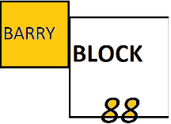

# Milestone_Project_Two_
### Developer/Author - Barry Cullen
 

## This project (Milestone Two) was completed as part of Code Institute's Full Stack Web Development course in 2020/21-

## Project Requirements:
-To create a Dynamic Front End Project, Write custom JavaScript, HTML and CSS code to create a front-end web application consisting of one or more HTML pages with significant interactive functionality. 

## Project Outline:
#### Bakery themed memory game – Remember The Order!

Remember The Order! is a humorous bakery themed memory game in the same vein as the classic Simon Says game of the 70s and 80s.
Which involves the computer making any number of random combinations of four game tiles which the player then has to follow in order to progress to the next level, with each level becoming increasingly more difficult as the number of combinations increases.

The Game begins as a simple presentztion clearly showing all elements and buttons, there is then a clear instruction for the palyer/user to turn on the game to begin.
The site will use a simple warm pleasant colour palatte, with other elements such as the Buttons and the heading in a contrasting but complemetary colour.

There are 8 elements visible to the player as they play the game
1. Game Title/heading that contains the name of this game.
2. The start taking orders Button which will allow the user to initate the game itself.
3. The prompter area with which information on game play as well as the initial begin game prompt will be located.
4. The four game button tiles, each one with an image of a bakery item which is the theme of the game. These will act as the main interface for player/user game play as they will be highlighted by the computer and will need to be replicaed by the player/user.
5. The 'NORMAL' button is a simplifed difficulty setting with allows the player/user to either select normal or hard mode.
6. The 'TUTORIAL' button when clicked on will show popup with a detailed text breakdown of how to play the game.
7. The level counter will allow the player/user to keep take of the level they are on.
8. The 'ON/OFF' button allows the user to reset the game and as a simple opening action to trigger game play.

## *UX*
#### Who is the target audience of this site?

“As a [persona], I [want to], [so that].” 
### User Stories

As a  player/user of this app, I want everything visible imeduiatly and easy to use.

As a player/user of this app, I want there to be enough time for audio and aniamtion to engae with ether me.
As a player/user of this app, I want the game to be easy initally but to become gradually more challenging and I want the option to make it more difficult.
As a  player/user of this app, I want the game to have a visually appealing theme, be simple, engaging and humourous.
As a player/user of this app, I want the game to initeate the directions for game play. 
As a  player/user of this app, I want to know when I've clicked on a button by having a responding audio or visual cue or both.
As a player/user of this app, I want to be able to play this on my phone or laptop.
##Design process

#### Links to wireframes
#### Mobile

#### Desktop 

### Colour design
For the colour palette, from here (https://coolors.co/fffcf2-ccc5b9-403d39-252422-eb5e28I) chose four colours to give it depth using the most vibrant as the background color, so as to  that will provoke a warm response from the player, like that of fresh baking.
The other colours grays and cream colurs where used to create a clear contrast in the buttons and with prompt messages to help readability and engagment. 

#### Colour palette :

- #EB5E28 as the primary background colour to provide a warm colour and a nice contrast to help readability.
- #252422 as a darker gray to help clearly show for the other buttons in the game against the warm background, the majority of the text and the main game title.
- #403D39 for  as a ligher gray to clearly show when start taking orders button is hoovered.
- #CCC5B9 for border color of the game button tiles when error or when the tiles are flashed.
- FFFCF2 ist the colour used sparingly in the project for contrast in hoovered over button text to improve readability.

### Typography

 The font were imported from Google Fonts.
https://fonts.googleapis.com/css2?family=VT323&display=swap
I used this font as it resembles the bitmap fonts used in older games,
as i wanted to give the game a retro feel.

###Audio
I created my own humourous sound effects for the button, errors, next level and for winning the game.
These sound files were used to give the game its interactive sounds.
Created using the open source software. (https://www.audacityteam.org/) 
###Images
The background image design, button image design, tutorial image and tab icon were all designed by Barry Cullen using the open-source software GIMP. (https://www.gimp.org/fr/) 

## *Features*

### Current Features

1. The game will prompt the player/user instructions via messages that will allow intutive game play.
2. The 'ON/OFF' button activates/deactivates the Game.
3. The 'NORMAL/HARD' button allows the player/user to select a greater in game difficulty.
4. Player/user can activate a popup window of the rules of the game by clicking the 'TUTORIAL' button. 
5. Game button tiles flash and play a sound when selected by the player/user.
6. Game button tiles flash and play a sound when activated as part of the computer sequence.
7. Game button tiles all animate, flash a border and play a sound when error is made or if they win the game
8. The level counter allows the player/user to follow there current level, with each success a sound is played and counter increases by one.
9.  Remember The Order! is responsive on various devices including smaller mobile devices.

### Additional features to add
1. Move difficulty setting such as being able to increase the speed.
2. I would like to find a way to stop the computer selecting the same tile twice in a row.
3. I would like to change the system from levels to a score based system with a highscore element.

### Technologies Used
#### Languages Used
      1. HTML5 
2. CSS3
3. Javascript

### Frameworks, Libraries & Programs
    
1. Code Institute Template - (https://github.com/Code-Institute-Org/gitpod-full-template)
2. Bootstrap 4 (https://getbootstrap.com/) was used to assist with the responsiveness and the Website's grid system.
3. Google Fonts (https://fonts.google.com/)were used to import the 'VT323' font into the style.css file which is used on all pages throughout the project. 
4. Font Awesome (https://fontawesome.com/) for the website icons for UX ease of use.
5. JQuery (https://jquery.com/) used along side the vanilla JS elements in script.js for html / style changes and as a DOM selector for some functions.
6. Gitpod (https://gitpod.io/) was used as a code development environment.
7. Git was used for version control by using the Gitpod terminal to commit to Git and Push to GitHub.
8. GitHub (https://github.com/) is used to store all the code for this project after pushing from Gitpod.
9. GIMP (https://www.gimp.org/fr/) was used to edit photos for the Website.
10. Balsamiq (https://balsamiq.com/) was used to create the wireframes during the design process.
11. Table generator(https://www.tablesgenerator.com/markdown_tables) for the table in the README
# *Testing*

### ***Code validation***
In the project, no syntax errors were detected, as validated by -
#### W3C Markup Validator - 
[Image-html-](assets/testing_images/)

#### W3C CSS Validator -
- [Image-css](assets/testing_images/)
#### Lighthouse report -
- [Image-lighthouse-report-screenshot](assets/testing_images/)
